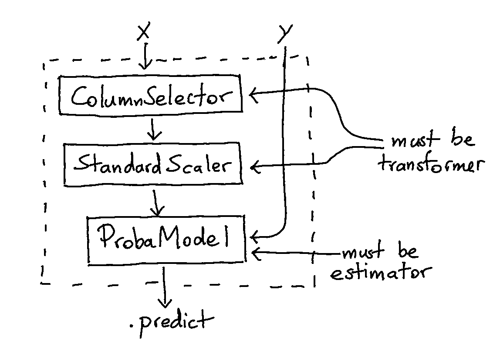
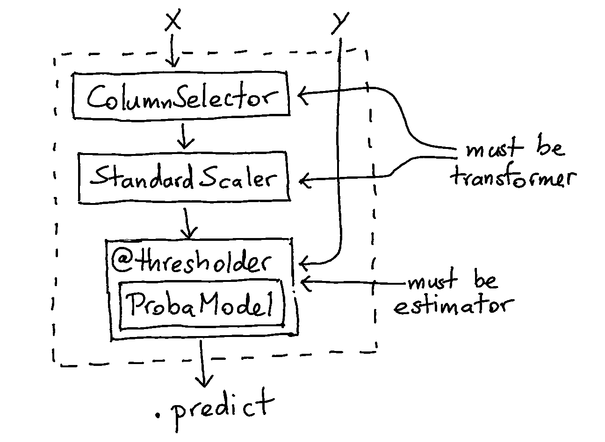
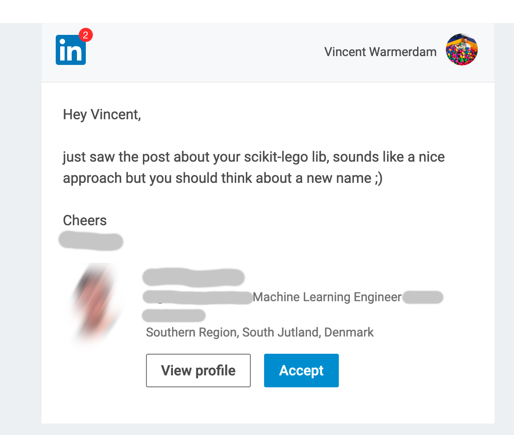

# A.I. Caramba: How to Maintain Sanity

.text-right[From (meta) workflow, to (meta) tools and even mental (meta) health.]

<iframe src="http://koaning.io/theme/iframes/predict-bw.html" scrolling="no" width="100%" height="400" frameborder="0"></iframe>

.footnote[**Vincent D. Warmerdam** - [blog](koaning.io) - [twitter](https://twitter.com/fishnets88)]

---

##### Alternative Title
# Untitled12.ipynb

<iframe src="http://koaning.io/theme/iframes/predict-bw.html" scrolling="no" width="100%" height="400" frameborder="0"></iframe>

.footnote[**Vincent D. Warmerdam** - [blog](koaning.io) - [twitter](https://twitter.com/fishnets88)]

---

## Topics for Today. 

### 1. Introduce a workflow

You might have a way of working that can be improved.

---

## Topics for Today. 

### 1. Introduce a workflow

You might have a way of working that can be improved.

### 2. Demonstrate the generality of it

This way of working is really general. You can easily make the tools you need.

---

## Topics for Today. 

### 1. Introduce a workflow

You might have a way of working that can be improved.

### 2. Demonstrate the generality of it

This way of working is really general. You can easily make the tools you need.

### 3. Learn how to get there

But to get there you need to learn a new habbit. 

By the end of this talk you'll hear at least one pitch and at least one poem.

---

layout: false

## Topics for Today. 

### 1. Introduce a workflow

Workflow **matters**. Why are we not using excel?

---

layout: false

## Topics for Today. 

### 1. Introduce a workflow

Workflow **matters**. Why are we not using excel?

1. We want to separate the data from the analysis. 
2. We want to be able to automate our analysis 
3. We want our analysis to be reproducible. 
4. We should not pay a third part obscene amounts of money for something as basic as arithmetic. This budget is better allocated towards innovation and education of staff.

---

layout: false

## Topics for Today. 

### 1. Introduce a workflow

Workflow **matters**. Why are we not using excel?

1. We want to separate the data from the analysis. 
2. We want to be able to automate our analysis 
3. We want our analysis to be reproducible. 
4. We should not pay a third part obscene amounts of money for something as basic as arithmetic. This budget is better allocated towards innovation and education of staff.

Today many analyses are still done with Excel. It frightens me. Many insurance companies depends on the floating point arithmetic of an excel spreadsheet to make sure that our pension plans don't fail.

A lot of this, thankfully, is changing now that we have pandas and jupyter.

---

layout: false

## Topics for Today. 

### 1. Introduce a workflow

Workflow **matters**. Why are we not using excel?

1. We want to separate the data from the analysis. 
2. We want to be able to automate our analysis 
3. We want our analysis to be reproducible. 
4. We should not pay a third part obscene amounts of money for something as basic as arithmetic. This budget is better allocated towards innovation and education of staff.

Today many analyses are still done with Excel. It frightens me. Many insurance companies depends on the floating point arithmetic of an excel spreadsheet to make sure that our pension plans don't fail.

A lot of this, thankfully, is changing now that we have pandas and jupyter. Or is it?

---

Time for a live demo.


---

### 1. Introduce a workflow


See the great material from [Tom Augspurger](http://tomaugspurger.github.io/modern-1-intro.html) for more tips on writing modern pandas. 

### 2. Demonstrate the generality of it

This way of working is really general. You can easily make the tools you need.

There's a great cooking analogy too.

---

## Pipelines

This is how most people cook. 

```bash
Take the chicken -> 
   Then season it, with spices -> 
   Then season it, with gravy -> 
   Then put it in the oven, at 210 celsius -> 
   Then serve it, on a plate
```

---

## Pipelines

You wouldn't dare describe this task with this grammar:

```bash
Serve -> the thing that(
    PutInOven( -> the thing that 
        Season( -> the thing that
            Season( -> the thing that 
                Chicken, with spices),
        with gravy),
    at 210 celsius), 
on a plate)
```

It sounds crazy, but a lot of people write code in this latter style. 

---

## Pipelines

You wouldn't dare describe this task with this grammar:

```bash
the_temperature = 210 celsius

food1 = Chicken
food2 = Season(food1, with Spices)
food3 = Season(food2, with Gravy)
Serve(PutInOven(food3, the_temperature), on a plate)
```

Seriously, it gets crazy quickly.

Code is like a user interface for thoughts. It is really important you get it right. You want to invite clarity and interoperability. This is what makes modern R so nice and pandas can learn a lot from it.

Scikit-learn is another pipeline. One you can like!

---

layout: false
.left-column[
  ## Pipelines
]
.right-column[

]

---


layout: false
.left-column[
  ## Pipelines
  ## Problems
]
.right-column[
  Suppose that we have this simple dataset.

  

  When is our performance best?
]
---
layout: false
.left-column[
  ## Pipelines
  ## Problems
]
.right-column[
  Maybe it doesn't matter much on preprocessing. 
  
  Probably the model doesn't matter too much either. 

  

  The most effective way of tuning for what we want is to set the threshold of the model.

  But this is an issue! 
  - The scikit-learn api does not offer this for every model. 
  - We might need to re-write every single estimator. 
  - You should be able to generalize this!
]
---
.left-column[
  ## Pipelines
  ## Problems
  ## Proposal
]
.right-column[
  
]
---
.left-column[
  ## Pipelines
  ## Problems
  ## Proposal
  ## Practice
]
.right-column[

## How would this work? 

We cannot use the exact same trick as before though. Where `pandas` uses functions we're using
classes here. We cannot have decorators on classes...

But you can have a class that "eats" another class!

```python
Decorator(est=Model(param_a, param_b), param_c)
```

The `Decorator` will output a scikit-learn compatible estimator. By decorating
classes in this fashion the `GridSearchCV` will be able to perform a grid search
on `param_a`, `param_b` and `param_c`. 

This is the essense of **MetaEstimators**. They're not new! They already exist in 
scikit learn. It's just that we expand on them.

]
---
.left-column[
  ## Pipelines
  ## Problems
  ## Proposal
  ## Practice
]
.right-column[

## Example

Here's an example of the `Thresholder`. 

```python
pipe = Pipeline([
    ("model", Thresholder(LogisticRegression(solver='lbfgs')))
])

grid = {"model__threshold": np.linspace(0.1, 0.9, 50)}

mod = GridSearchCV(estimator=pipe,
                   param_grid = grid,
                   scoring={...},
                   refit=...,
                   cv=5)

mod.fit(X, y);
```
]

---
.left-column[
  ## Pipelines
  ## Problems
  ## Proposal
  ## Practice
]
.right-column[

## Example

Here's an example of the `Thresholder`. 

```python
grid = {"model__threshold": np.linspace(0.1, 0.9, 50)}
```


]

---
.left-column[
  ## Pipelines
  ## Problems
  ## Proposal
  ## Practice
]
.right-column[

## GroupedEstimator

```python
from sklego.meta import GroupedEstimator
mod = GroupedEstimator(LinearRegression(), groups=["diet"])
plot_model(mod)
```


This might be a better way to deal with factors. Note that we also support hierarchical groups (using shrinkage).
]
---
.left-column[
  ## Pipelines
  ## Problems
  ## Proposal
  ## Practice
  ## More!
]
.right-column[

## DecayEstimator

Click models together! 

```python
mod1 = (GroupedEstimator(DummyRegressor(), groups=["m"])
        .fit(df[['m']], df['yt']))


mod2 = (GroupedEstimator(DecayEstimator(DummyRegressor(), decay=0.9), groups=["m"])
        .fit(df[['index', 'm']], df['yt']))
```


]
---
.left-column[
  ## Pipelines
  ## Problems
  ## Proposal
  ## Practice
  ## More!
]
.right-column[

## Scikit-Lego


It started when Matthijs Brouns and myself wanted to scratch our own itch and when
we wanted to have a place where we could teach students how to commit to open source.
]
---
.left-column[
  ## Pipelines
  ## Problems
  ## Proposal
  ## Practice
  ## More!
]
.right-column[

## Scikit-Lego

It is getting popular too [](https://pepy.tech/project/scikit-lego/month).
]
---
.left-column[
  ## Pipelines
  ## Problems
  ## Proposal
  ## Practice
  ## More!
]
.right-column[

Really popular. 



Can we guess where this person might work?
]
---
.left-column[
  ## Pipelines
  ## Problems
  ## Proposal
  ## Practice
  ## More!
]
.right-column[

That's right.


When I was young I played with toys from lego. 
In 2019 it seems like folks there are playing with my toys! 

**This was super inspiring. Live demo!**

```python
from sklego import this
```

]

---

## Roses are red, violets are blue,
## naming your package is really hard to undo.

---

## Haste can make decisions in one fell swoop,
## note that LEGO® is a trademark of the LEGO Group.

---

## It really makes sense, we do not need to bluff,
## LEGO does not sponsor, authorize or endorse any of this stuff.

---

## Look at all the features and look at all the extensions,
## the path towards ruin is paved with good intentions.

---

## Be careful with features as they tend to go sour,
## defer responsibility to the end user, this might just give them power.

---

## If you don't know the requirements you don't know if they're met.
## If you haven't gotten to where you're going, you aren't there yet.

---

## Infinity is ever present, the unknown may be ignored,
## don't do it all, not everything needs to be explored.

---

## Change everything and you'll soon be a jerk,
## you may invent a new tool, not a way to work.

---

## Some problems cannot be solved in a single day,
## but if you ignore them, they sometimes go away.

---

## There's a lot of power in simplicity,
## it keeps you approach strong,
## if you understand the solution better than the problem,
## you're doing it wrong.

---

.left-column[
  ## Meta
]
.right-column[
There's an issue on github where we allow other contributors to add lessons to the poem. It's one of the ways we like to say thank you. 
]

---

.left-column[
  ## Meta
]
.right-column[
There's an issue on github where we allow other contributors to add lessons to the poem. It's one of the ways we like to say thank you. 

For larger contributions we also send a handwritten note with a project sticker. It made a guy in brazil **really** happy. But it should, it made us happy that we now live in an era where somebody from the other side of the world can randomly help out. 

Sidenote: there's gonna be a PyData Sao Paulo someday.
]

---

.left-column[
  ## Meta
]
.right-column[

The future is awesome, all we have to do is build it. 

</img>

]

---

.left-column[
  ## Meta
]
.right-column[
I like to think that I can make these improvements not because I am 
super clever or something. I rather like to think that I have a very
concious habbit: **reflection**.


]

---

.left-column[
  ## Meta
]
.right-column[

]

---

Here's another itch I've scratched <a href="https://drawdata.xyz">drawdata.xyz</a>.

<iframe src="https://drawdata.xyz/scatter.html" width="960" height="550" frameBorder="0"></iframe>